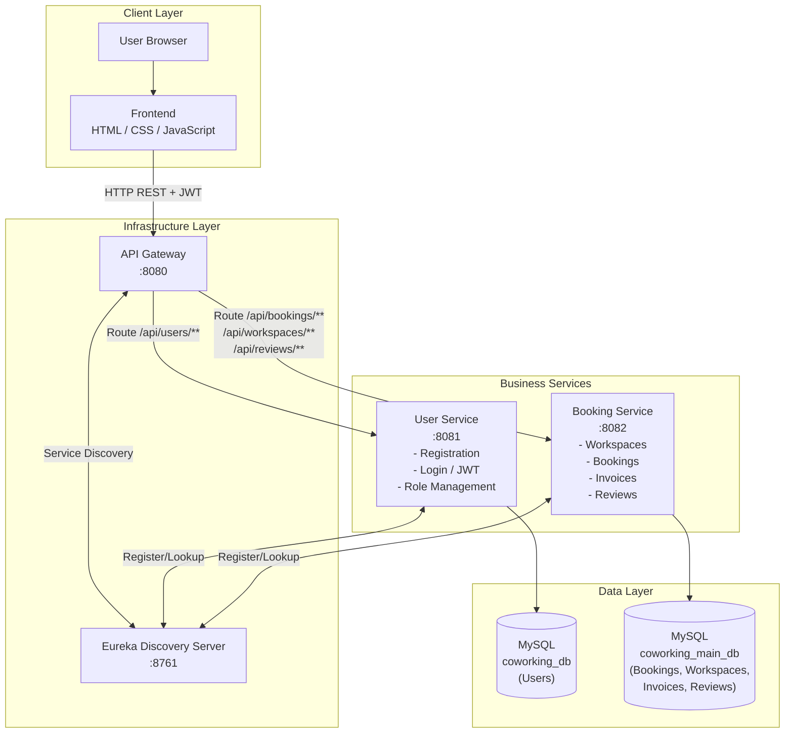
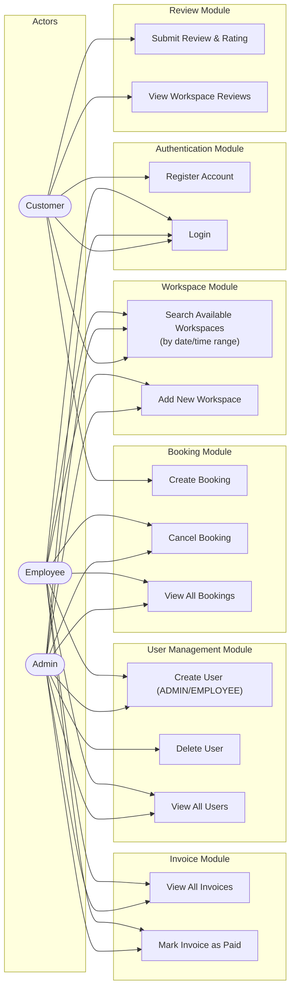
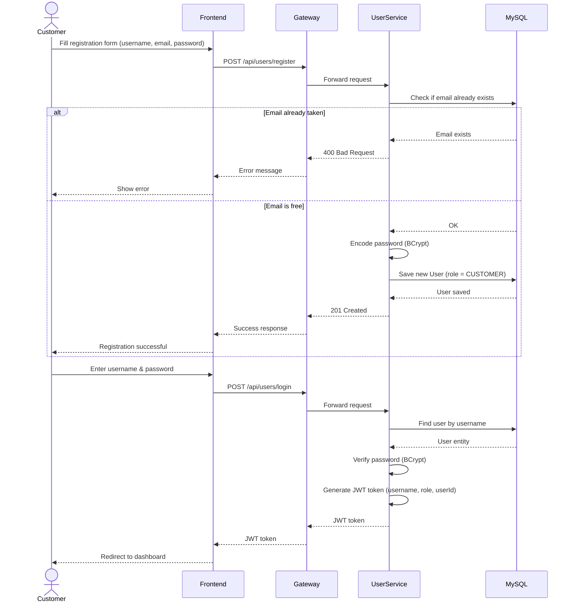
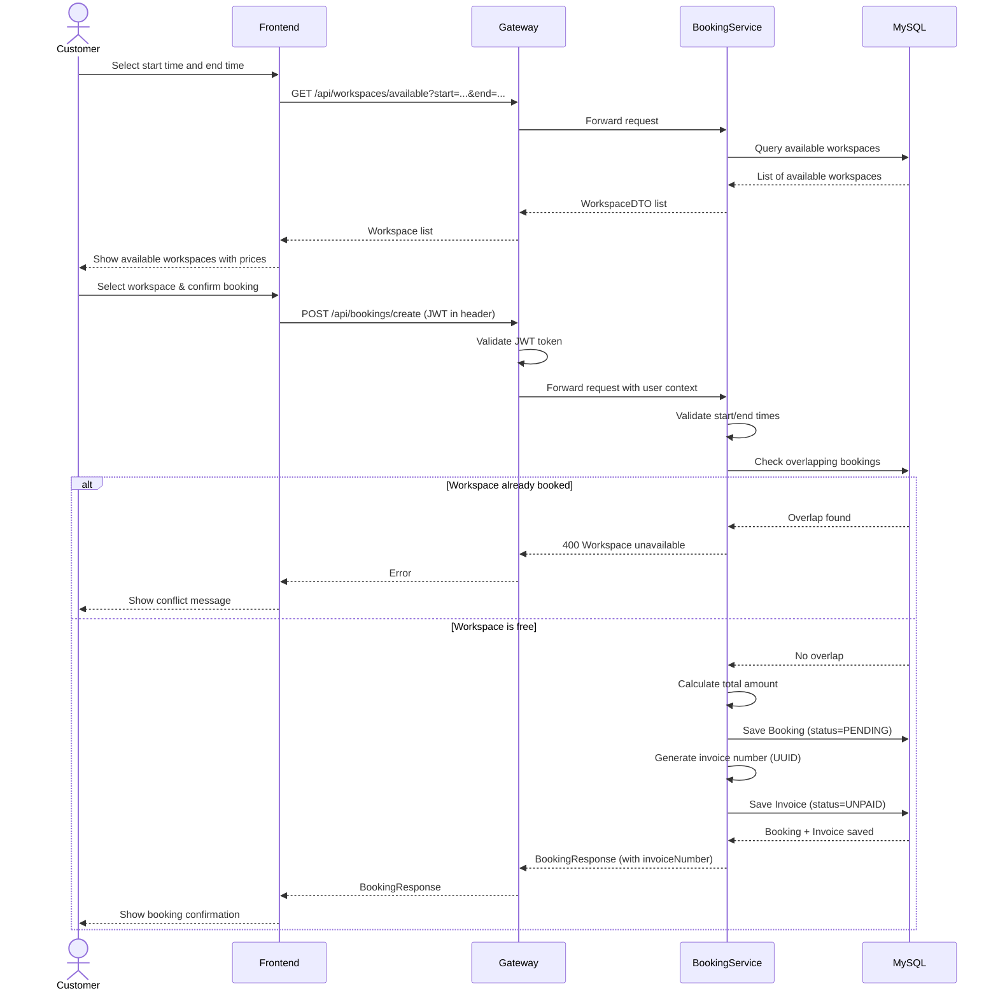
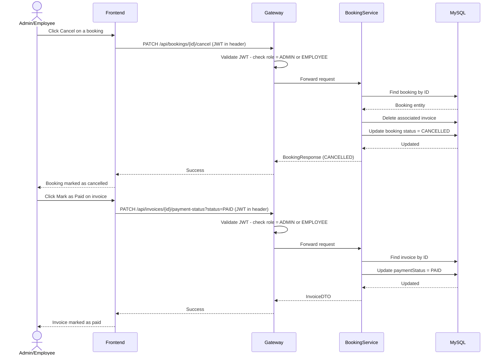
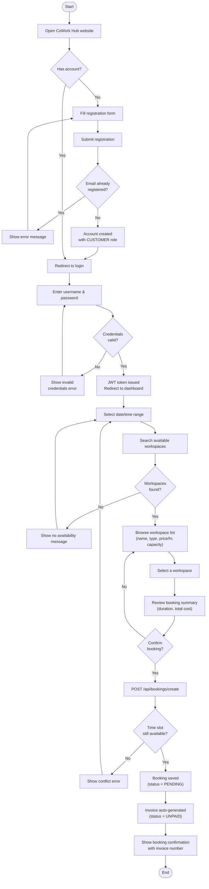
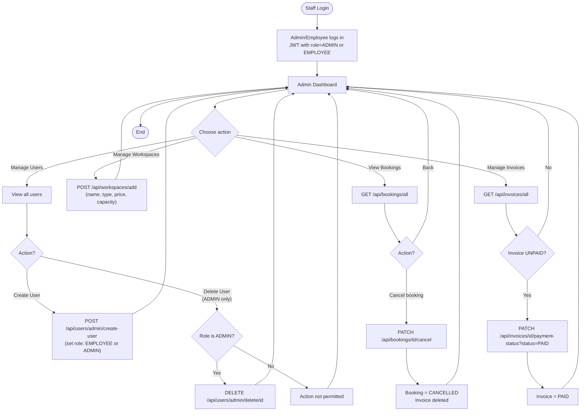

# Software Requirements Specification

## Cover Page

**Project Title:**  
CoWork Hub: Coworking Space Booking and Management System

**Course Name:**  
Software Engineering 2

**Course Code:**  
SE2


## Team Information

| Team Member Name | Student ID |
|---|---|
| احمد عادل الدرغامي زايد | 20230024 |
| احمد مجدي محمد عبدالحميد | 20230034 |
| ابراهيم عبدالناصر محفوظ | 20230004 |
| زياد مصطفى احمد عبده | 20230240 |
| مصطفى عتريس عبدالكريم | 20220484 |
| جون يوسف انور داود | 20230162 |

## Table of Contents

1. Introduction
2. Overall Description
3. Functional Requirements
4. Non-Functional Requirements
5. External Interface Requirements
6. Use Cases
7. Data Requirements
8. System Architecture
9. Entity Relationship Diagram (ERD)
10. Use Case Diagram
11. Class Diagram
12. Sequence Diagram
13. Activity Diagram
14. Constraints
15. Future Enhancements
16. OCL Constraints
17. Design Patterns
18. Conclusion

## Project Title
CoWork Hub: Coworking Space Booking and Management System

## 1. Introduction

### 1.1 Purpose
This document defines the software requirements for CoWork Hub, a web-based system for managing coworking spaces, user accounts, bookings, invoices, and reviews. The system is designed as a microservices-based application using Spring Boot and Spring Cloud.

### 1.2 Scope
CoWork Hub allows customers to register, log in, browse available workspaces, create bookings, and submit reviews. It also provides an admin interface to manage users, workspaces, bookings, and invoices. The system uses a gateway for unified access, a discovery server for service registration, and a MySQL database for persistence.

### 1.3 Intended Audience
- Course instructor and teaching assistants
- Project team members
- Testers and reviewers

### 1.4 Definitions and Abbreviations
- SRS: Software Requirements Specification
- API: Application Programming Interface
- JWT: JSON Web Token
- RBAC: Role-Based Access Control
- AOP: Aspect-Oriented Programming
- DB: Database

## 2. Overall Description

### 2.1 Product Perspective
The system is composed of the following backend services:
- `discovery-service`: Eureka server for service discovery
- `gateway-service`: single entry point for frontend requests
- `user-service`: user registration, login, role management
- `booking-service`: workspace management, bookings, invoices, reviews

The frontend is a static web interface that communicates with the backend through the API gateway.

### 2.2 Product Functions
- User registration and login
- Role-based access control for `ADMIN`, `EMPLOYEE`, and `CUSTOMER`
- Search available workspaces by time range
- Create and cancel bookings
- Generate invoices automatically
- Mark invoices as paid
- Add and display workspace reviews
- Admin management of users and workspaces
- Service discovery using Spring Cloud Eureka
- API routing using Spring Cloud Gateway
- Logging and execution tracking using AOP

### 2.3 User Classes
- `Customer`
  - Registers and logs in
  - Searches for workspaces
  - Creates bookings
  - Adds reviews
- `Admin`
  - Manages users (Create and Delete)
  - Adds workspaces
  - Cancels bookings
  - Updates invoice payment status
  - Views all bookings and invoices
- `Employee`
  - Creates users (cannot delete)
  - Adds workspaces
  - Cancels bookings
  - Updates invoice payment status
  - Views all bookings and invoices

### 2.4 Operating Environment
- Frontend: HTML, CSS, JavaScript
- Backend: Java 25, Spring Boot 3.5.x
- Cloud components: Spring Cloud 2025.x, Eureka, Gateway
- Database: MySQL 8
- Containerization: Docker and Docker Compose
- OS: Windows for development, containerized Linux runtime for Docker deployment

### 2.5 Assumptions and Dependencies
- Users access the system through a modern web browser
- MySQL is available either locally or through Docker
- Services communicate over HTTP inside the microservices environment
- JWT is used for authentication and authorization

## 3. Functional Requirements

### FR-1 User Registration
The system shall allow a new customer to create an account using username, email, and password.

### FR-2 User Login
The system shall authenticate a user and issue a JWT token after successful login.

### FR-3 Role-Based Authorization
The system shall restrict access to protected endpoints based on user role.

### FR-4 Workspace Management
The system shall allow an admin or employee to add a new workspace with name, type, description, price per hour, capacity, and availability status.

### FR-5 Workspace Availability Search
The system shall allow a customer to search for available workspaces by start time and end time.

### FR-6 Booking Creation
The system shall allow a customer to create a booking for an available workspace within a valid future time range.

### FR-7 Booking Validation
The system shall reject bookings with invalid times or overlapping reservations.

### FR-8 Booking Cancellation
The system shall allow an admin or employee to cancel an existing booking.

### FR-9 Invoice Generation
The system shall automatically create an invoice when a booking is created.

### FR-10 Invoice Payment Status Update
The system shall allow an admin or employee to update invoice payment status from `UNPAID` to `PAID`.

### FR-11 Review Submission
The system shall allow a customer to submit a review and rating for a workspace.

### FR-12 Review Display
The system shall display reviews for a workspace, including reviewer username, rating, and comment.

### FR-13 User Management
The system shall allow an admin or employee to create users. Only an admin shall be allowed to delete non-admin users.

### FR-14 Booking and Invoice Viewing
The system shall allow authorized staff to view all bookings and invoices.

### FR-15 API Gateway
The system shall route frontend requests through a gateway service.

### FR-16 Service Discovery
The system shall register backend services with Eureka for discovery.

## 4. Non-Functional Requirements

### NFR-1 Security
- The system shall use JWT authentication.
- Passwords shall be stored in encrypted form.
- Protected endpoints shall require valid tokens.

### NFR-2 Performance
- The system should respond to normal API requests within a reasonable time under typical classroom-demo load.

### NFR-3 Availability
- Services should be independently deployable and restartable.

### NFR-4 Maintainability
- The backend shall follow layered architecture: controller, service, repository, model.
- Cross-cutting logging concerns shall be handled using AOP.

### NFR-5 Scalability
- The microservices architecture shall support separate service deployment and future expansion.

### NFR-6 Portability
- The system shall support containerized deployment using Docker.

### NFR-7 Usability
- The frontend shall provide a clear workflow for login, searching, booking, reviewing, and admin operations.

## 5. External Interface Requirements

### 5.1 User Interface
- Login and registration page
- Customer dashboard
- Admin dashboard
- Forms for booking, reviewing, and workspace creation

### 5.2 Software Interfaces
- Gateway to user-service and booking-service
- Eureka server for service discovery
- MySQL database for persistence

### 5.3 Communication Interfaces
- HTTP/REST communication between frontend and gateway
- HTTP communication among microservices

## 6. Use Cases

### UC-1 Register Account
Actor: Customer  
Precondition: User is not authenticated  
Main Flow:
1. User enters registration information.
2. System validates input.
3. System creates account with `CUSTOMER` role.
4. System confirms successful registration.

### UC-2 Login
Actor: Customer/Admin/Employee  
Precondition: Account exists  
Main Flow:
1. User enters username and password.
2. System verifies credentials.
3. System issues JWT token.
4. User is redirected to the appropriate dashboard.

### UC-3 Search Available Workspaces
Actor: Customer  
Precondition: User is logged in  
Main Flow:
1. User selects start and end time.
2. System checks bookings in the selected period.
3. System returns available workspaces.

### UC-4 Create Booking
Actor: Customer  
Precondition: User is logged in and workspace is available  
Main Flow:
1. User selects workspace.
2. System calculates booking duration and total cost.
3. System asks for booking confirmation.
4. System stores booking and creates invoice.

### UC-5 Cancel Booking
Actor: Admin/Employee  
Precondition: Booking exists  
Main Flow:
1. Admin selects a booking.
2. System changes its status to `CANCELLED`.

### UC-6 Mark Invoice as Paid
Actor: Admin/Employee  
Precondition: Invoice exists  
Main Flow:
1. Admin selects an unpaid invoice.
2. System updates payment status to `PAID`.

### UC-7 Add Review
Actor: Customer  
Precondition: User is logged in  
Main Flow:
1. User enters workspace id, rating, and comment.
2. System validates the review.
3. System stores the review.
4. System displays the review list.

## 7. Data Requirements

### 7.1 User
- `id`
- `username`
- `password`
- `email`
- `role`

### 7.2 Workspace
- `id`
- `name`
- `type`
- `description`
- `pricePerHour`
- `capacity`
- `available`

### 7.3 Booking
- `id`
- `userId`
- `workspace`
- `startTime`
- `endTime`
- `totalAmount`
- `status`

### 7.4 Invoice
- `id`
- `invoiceNumber`
- `amount`
- `issuedAt`
- `paymentStatus`
- `booking`

### 7.5 Review
- `id`
- `userId`
- `workspace`
- `rating`
- `comment`

## 8. System Architecture

The system follows a **Microservices Architecture** composed of four independent Spring Boot services, all orchestrated through Docker Compose.



## 10. Use Case Diagram



## 11. Class Diagram

```mermaid
classDiagram
    class User {
        -Long id
        -String username
        -String password
        -String email
        -Role role
        +getId() Long
        +getUsername() String
        +getPassword() String
        +getEmail() String
        +getRole() Role
        +setId(Long) void
        +setUsername(String) void
        +setPassword(String) void
        +setEmail(String) void
        +setRole(Role) void
        +builder()$ UserBuilder
    }

    class Role {
        <<enumeration>>
        ADMIN
        EMPLOYEE
        CUSTOMER
    }

    class Workspace {
        -Long id
        -String name
        -WorkspaceType type
        -String description
        -Double pricePerHour
        -Integer capacity
        -boolean available
        -List~Review~ reviews
        +getId() Long
        +getName() String
        +getType() WorkspaceType
        +getDescription() String
        +getPricePerHour() Double
        +getCapacity() Integer
        +isAvailable() boolean
        +getReviews() List~Review~
        +builder()$ WorkspaceBuilder
    }

    class WorkspaceType {
        <<enumeration>>
        MEETING_ROOM
        PRIVATE_OFFICE
        DEDICATED_DESK
        SHARED_SPACE
    }

    class Booking {
        -Long id
        -Long userId
        -Workspace workspace
        -LocalDateTime startTime
        -LocalDateTime endTime
        -Double totalAmount
        -String status
        -Invoice invoice
        +getId() Long
        +getUserId() Long
        +getWorkspace() Workspace
        +getStartTime() LocalDateTime
        +getEndTime() LocalDateTime
        +getTotalAmount() Double
        +getStatus() String
        +getInvoice() Invoice
        +setStatus(String) void
        +setInvoice(Invoice) void
        +builder()$ BookingBuilder
    }

    class Invoice {
        -Long id
        -String invoiceNumber
        -Double amount
        -LocalDateTime issuedAt
        -String paymentStatus
        -Booking booking
        +getId() Long
        +getInvoiceNumber() String
        +getAmount() Double
        +getIssuedAt() LocalDateTime
        +getPaymentStatus() String
        +getBooking() Booking
        +setPaymentStatus(String) void
        +builder()$ InvoiceBuilder
    }

    class Review {
        -Long id
        -Long userId
        -Integer rating
        -String comment
        -Workspace workspace
        +getId() Long
        +getUserId() Long
        +getRating() Integer
        +getComment() String
        +getWorkspace() Workspace
        +builder()$ ReviewBuilder
    }

    class UserRepository {
        <<interface>>
        +findByUsername(String) Optional~User~
        +existsByEmail(String) boolean
    }

    class BookingRepository {
        <<interface>>
        +findByUserId(Long) List~Booking~
        +findBookedWorkspaceIdsInPeriod(LocalDateTime, LocalDateTime) List~Long~
        +existsOverlappingBooking(Long, LocalDateTime, LocalDateTime) boolean
    }

    class WorkspaceRepository {
        <<interface>>
        +findByAvailableTrue() List~Workspace~
        +findByType(WorkspaceType) List~Workspace~
        +findByIdNotIn(List~Long~) List~Workspace~
    }

    class InvoiceRepository {
        <<interface>>
        +findByInvoiceNumber(String) Optional~Invoice~
        +findByBookingId(Long) Optional~Invoice~
    }

    class ReviewRepository {
        <<interface>>
        +findByWorkspaceId(Long) List~Review~
    }

    class UserService {
        <<interface>>
        +registerUser(RegisterRequest) User
        +createUserByAdmin(RegisterRequest) User
        +login(LoginRequest) String
        +getAllUsers() List~User~
        +getUserById(Long) User
        +getUsernamesByIds(List~Long~) Map~Long String~
        +deleteUser(Long) void
    }

    class UserServiceImpl {
        -UserRepository userRepository
        -BCryptPasswordEncoder passwordEncoder
        -JwtService jwtService
        +registerUser(RegisterRequest) User
        +createUserByAdmin(RegisterRequest) User
        +login(LoginRequest) String
        +getAllUsers() List~User~
        +getUserById(Long) User
        +getUsernamesByIds(List~Long~) Map~Long String~
        +deleteUser(Long) void
    }

    class BookingService {
        -BookingRepository bookingRepository
        -WorkspaceRepository workspaceRepository
        -InvoiceRepository invoiceRepository
        +createBooking(BookingRequest) BookingResponse
        +getAllBookings() List~BookingResponse~
        +cancelBooking(Long) BookingResponse
    }

    class WorkspaceService {
        -WorkspaceRepository workspaceRepository
        -BookingRepository bookingRepository
        +getAvailableWorkspaces(LocalDateTime, LocalDateTime) List~WorkspaceDTO~
        +saveWorkspace(Workspace) Workspace
    }

    class InvoiceService {
        -InvoiceRepository invoiceRepository
        +getAllInvoices() List~InvoiceDTO~
        +getInvoiceByNumber(String) InvoiceDTO
        +updatePaymentStatus(Long, String) InvoiceDTO
    }

    class ReviewService {
        -ReviewRepository reviewRepository
        -WorkspaceRepository workspaceRepository
        +addReview(ReviewRequest) void
        +getReviewsByWorkspace(Long) List~ReviewDTO~
    }

    class UserController {
        -UserService userService
        +register(RegisterRequest) ResponseEntity
        +login(LoginRequest) ResponseEntity
        +createUserByAdmin(RegisterRequest) ResponseEntity
        +getAllUsers() ResponseEntity
        +getUsernamesByIds(List~Long~) ResponseEntity
        +deleteUser(Long) ResponseEntity
    }

    class BookingController {
        -BookingService bookingService
        +createBooking(BookingRequest) ResponseEntity
        +cancelBooking(Long) ResponseEntity
        +getAllBookings() ResponseEntity
    }

    class WorkspaceController {
        -WorkspaceService workspaceService
        +getAvailable(LocalDateTime, LocalDateTime) ResponseEntity
        +addWorkspace(Workspace) ResponseEntity
    }

    class InvoiceController {
        -InvoiceService invoiceService
        +getAllInvoices() ResponseEntity
        +updateStatus(Long, String) ResponseEntity
    }

    class ReviewController {
        -ReviewService reviewService
        +addReview(ReviewRequest) ResponseEntity
        +getReviewsByWorkspace(Long) ResponseEntity
    }

    class JwtService {
        -String SECRET_KEY
        -getSigningKey() Key
        +generateToken(String, String, Long) String
    }

    class JwtAuthenticationFilter {
        -String SECRET_KEY
        #doFilterInternal(HttpServletRequest, HttpServletResponse, FilterChain) void
    }

    class LoggingAspect {
        <<aspect>>
        +applicationLayer() void
        +logExecutionTime(ProceedingJoinPoint) Object
    }

    User --> Role : has
    Workspace --> WorkspaceType : has
    Workspace "1" --> "0..*" Review : receives
    Workspace "1" --> "0..*" Booking : has
    Booking --> Workspace : reserved in
    Booking "1" --> "1" Invoice : generates
    Review --> Workspace : about

    UserServiceImpl ..|> UserService : implements
    UserServiceImpl --> UserRepository : uses
    UserServiceImpl --> JwtService : uses

    BookingService --> BookingRepository : uses
    BookingService --> WorkspaceRepository : uses
    BookingService --> InvoiceRepository : uses
    WorkspaceService --> WorkspaceRepository : uses
    WorkspaceService --> BookingRepository : uses
    InvoiceService --> InvoiceRepository : uses
    ReviewService --> ReviewRepository : uses
    ReviewService --> WorkspaceRepository : uses

    UserController --> UserService : delegates to
    BookingController --> BookingService : delegates to
    WorkspaceController --> WorkspaceService : delegates to
    InvoiceController --> InvoiceService : delegates to
    ReviewController --> ReviewService : delegates to

    LoggingAspect ..> UserController : advises
    LoggingAspect ..> UserServiceImpl : advises
    LoggingAspect ..> BookingController : advises
    LoggingAspect ..> BookingService : advises
    LoggingAspect ..> WorkspaceController : advises
    LoggingAspect ..> WorkspaceService : advises
    LoggingAspect ..> InvoiceController : advises
    LoggingAspect ..> InvoiceService : advises
    LoggingAspect ..> ReviewController : advises
    LoggingAspect ..> ReviewService : advises
```



## 12. Sequence Diagrams

### 12.1 User Registration & Login



### 12.2 Create Booking Flow



### 12.3 Admin/Employee: Cancel Booking & Mark Invoice Paid



## 13. Activity Diagrams

### 13.1 Customer Booking Flow



### 13.2 Admin/Employee Management Flow



## 14. Constraints
- The current system assumes one frontend client communicates through the gateway.
- The booking service stores `userId` instead of a full user entity because user management is separated into a different microservice.
- The system is intended for educational/demo use and can be extended for production-grade requirements later.

## 15. Future Enhancements
- Add booking history per customer
- Add employee workflow features
- Add email notifications
- Add advanced invoice filtering and reporting
- Add Config Server as a separate service if required

## 16. OCL Constraints

The following Object Constraint Language (OCL) constraints describe the core business rules of the CoWork Hub system. These constraints are derived from the implemented validation and business logic in the backend services.

### 15.1 User Constraints

#### OCL-1 Username must not be empty
```ocl
context User
inv UsernameRequired:
    self.username <> ''
```

#### OCL-2 Email must not be empty
```ocl
context User
inv EmailRequired:
    self.email <> ''
```

#### OCL-3 Password must not be empty
```ocl
context User
inv PasswordRequired:
    self.password <> ''
```

#### OCL-4 Public registration creates only customer accounts
```ocl
context User
inv PublicRegistrationCreatesCustomer:
    self.role = Role::CUSTOMER
```

### 15.2 Workspace Constraints

#### OCL-5 Workspace name is required
```ocl
context Workspace
inv WorkspaceNameRequired:
    self.name <> ''
```

#### OCL-6 Workspace price must be non-negative
```ocl
context Workspace
inv NonNegativePrice:
    self.pricePerHour >= 0
```

#### OCL-7 Workspace capacity must be at least one
```ocl
context Workspace
inv MinimumCapacity:
    self.capacity >= 1
```

#### OCL-8 Workspace type must be specified
```ocl
context Workspace
inv WorkspaceTypeRequired:
    self.type <> null
```

### 15.3 Booking Constraints

#### OCL-9 Booking must be linked to a workspace
```ocl
context Booking
inv BookingMustHaveWorkspace:
    self.workspace <> null
```

#### OCL-10 Booking must be linked to a user identifier
```ocl
context Booking
inv BookingMustHaveUser:
    self.userId <> null
```

#### OCL-11 Booking start time must be in the future or present
```ocl
context Booking
inv StartTimeValid:
    self.startTime >= now
```

#### OCL-12 Booking end time must be after start time
```ocl
context Booking
inv EndAfterStart:
    self.endTime > self.startTime
```

#### OCL-13 Booking total amount must not be negative
```ocl
context Booking
inv NonNegativeTotalAmount:
    self.totalAmount >= 0
```

#### OCL-14 Booking status must be one of the supported values
```ocl
context Booking
inv ValidBookingStatus:
    self.status = 'PENDING' or
    self.status = 'CONFIRMED' or
    self.status = 'CANCELLED'
```

#### OCL-15 Two active bookings for the same workspace must not overlap
```ocl
context Booking
inv NoOverlappingBookings:
    Booking.allInstances()->forAll(b1, b2 |
        b1 <> b2 and
        b1.workspace = b2.workspace and
        b1.status <> 'CANCELLED' and
        b2.status <> 'CANCELLED'
        implies
        b1.endTime <= b2.startTime or
        b2.endTime <= b1.startTime
    )
```

### 15.4 Invoice Constraints

#### OCL-16 Every invoice must belong to one booking
```ocl
context Invoice
inv InvoiceMustBelongToBooking:
    self.booking <> null
```

#### OCL-17 Invoice amount must not be negative
```ocl
context Invoice
inv InvoiceAmountNonNegative:
    self.amount >= 0
```

#### OCL-18 Invoice payment status must be valid
```ocl
context Invoice
inv ValidPaymentStatus:
    self.paymentStatus = 'PAID' or
    self.paymentStatus = 'UNPAID'
```

#### OCL-19 Invoice amount must match its booking total amount
```ocl
context Invoice
inv InvoiceMatchesBooking:
    self.amount = self.booking.totalAmount
```

### 15.5 Review Constraints

#### OCL-20 Review must belong to a workspace
```ocl
context Review
inv ReviewMustBelongToWorkspace:
    self.workspace <> null
```

#### OCL-21 Review must be linked to a user identifier
```ocl
context Review
inv ReviewMustHaveUser:
    self.userId <> null
```

#### OCL-22 Review rating must be between 1 and 5
```ocl
context Review
inv RatingRange:
    self.rating >= 1 and self.rating <= 5
```

### 15.6 Derived Business Rules

#### OCL-23 Cancelling a booking removes its invoice from the active invoice list
```ocl
context Booking
inv CancelledBookingHasNoActiveInvoice:
    self.status = 'CANCELLED' implies self.invoice = null
```

#### OCL-24 A review display entry should present reviewer username rather than raw user identifier
```ocl
context Review
inv ReviewDisplayUsesUsername:
    self.userId <> null implies true
```

Note: OCL-24 is a presentation-oriented rule supported by frontend lookup logic that maps `userId` to `username` before display.

## 17. Design Patterns

The CoWork Hub system applies three well-known software design patterns throughout its codebase.

### 17.1 Builder Pattern

All model and DTO classes use the **Builder Pattern** via Lombok's `@Builder` annotation. This allows objects to be constructed in a readable, step-by-step way without long constructor argument lists.

**Example — creating a Booking object in `BookingService`:**
```java
Booking booking = Booking.builder()
    .userId(request.getUserId())
    .workspace(workspace)
    .startTime(request.getStartTime())
    .endTime(request.getEndTime())
    .totalAmount(totalAmount)
    .status("PENDING")
    .build();
```

This pattern is applied consistently across: `User`, `Workspace`, `Booking`, `Invoice`, `Review`, `BookingRequest`, `BookingResponse`, `WorkspaceDTO`, `ReviewDTO`, and `InvoiceDTO`.

### 17.2 Strategy Pattern

The **Strategy Pattern** is applied through interface-based programming in the user service. The `UserService` interface defines the contract, and `UserServiceImpl` provides the concrete implementation. This allows the implementation to be swapped without changing the controller layer.

```java
// Interface (Strategy)
public interface UserService {
    User registerUser(RegisterRequest request);
    String login(LoginRequest request);
    List<User> getAllUsers();
    void deleteUser(Long id);
}

// Concrete implementation
@Service
public class UserServiceImpl implements UserService {
    // actual logic here
}
```

The controller depends only on the `UserService` interface, not the implementation:
```java
private final UserService userService; // injected by Spring
```

### 17.3 Repository Pattern

The **Repository Pattern** is used throughout via Spring Data JPA. Each entity has a dedicated repository interface that abstracts all database access. Controllers and services never interact with the database directly.

```java
public interface BookingRepository extends JpaRepository<Booking, Long> {
    boolean existsOverlappingBooking(Long workspaceId,
        LocalDateTime start, LocalDateTime end);
}
```

Repositories used: `UserRepository`, `BookingRepository`, `WorkspaceRepository`, `InvoiceRepository`, `ReviewRepository`.

## 18. Conclusion
CoWork Hub provides a complete microservices-based coworking management solution with authentication, workspace booking, invoice generation, and review management. The system aligns with the course requirement of using Spring Boot, Spring Cloud, AOP, role-based security, REST APIs, frontend integration, database persistence, and Docker deployment.
